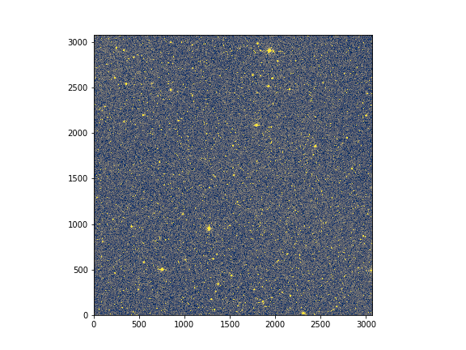

# Ziff


** Ziff is a wrapper to use Piff on ZTF images **

## Credit

R. Graziani (r.graziani@clermont.in2p3.fr, CNRS/IN2P3), M. Rigault (m.rigault@ipnl.in2p3.fr, CNRS/IN2P3)


# Installation

You first need Piff compatible with ZTF:
```bash
git clone https://github.com/rgraz/PIFFZTF.git
cd PIFFZTF
python setup.py install
```

(Requirements galsim, treecorr, available @ https://github.com/rmjarvis, together with latest version of Piff)

And ztfquery, ztfimg  (available @ https://github.com/MickaelRigault)

Then,
```bash
git clone https://github.com/rgraz/ziff.git
cd ziff
python setup.py install
```

# Fitting PSF on ZTF.

## One image ( = 1 quadrant)

Choose an image, for example `ztf_20190917468333_000698_zi_c03_o_q2_sciimg.fits`. And instanciate Ziff.

```python
from ziff.ziff import Ziff
z = Ziff( `ztf_20190917468333_000698_zi_c03_o_q2_sciimg.fits`, mskimg = None )

z.get_ztfimg()[0].show()
```


If no mskimg is given, ziff will look for one using the sciimg prefix. It also builds on the fly standard catalogs to calibrate PSF from  gaia online catalogs. These are accessible through the attribute `z.catalog`.

Default PSF configuration input to piff is given in `ziff/data/default_config.json` file and is accessible through attribute `z.config`.
It can be changed the following way:
```python
z.set_config_value('i/o,nstars',200)
z.set_config_value('psf,interp,order',2)
z.set_config_value('psf,outliers,max_remove',20)
```

The PSF fit itself is done by using `run_piff` method to a catalog or catalog name.
```python
z.run_piff('gaia_calibration',overwrite_cat=True)
```

