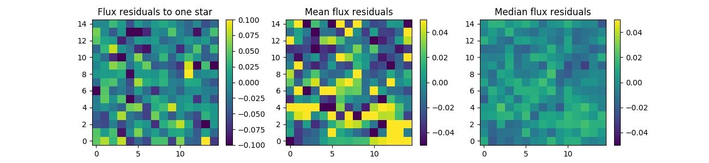
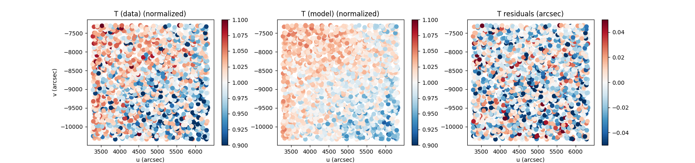
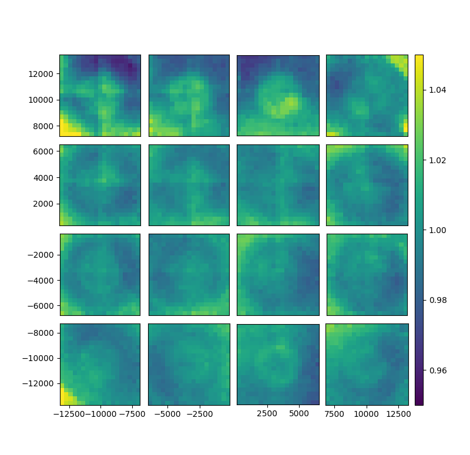
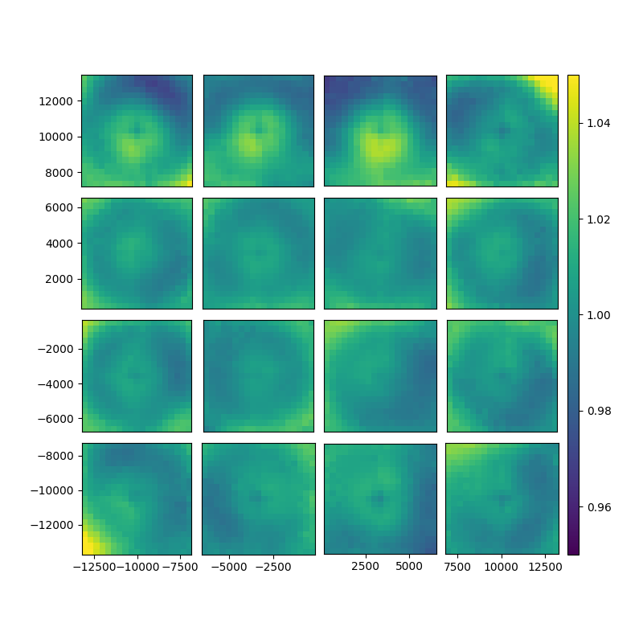
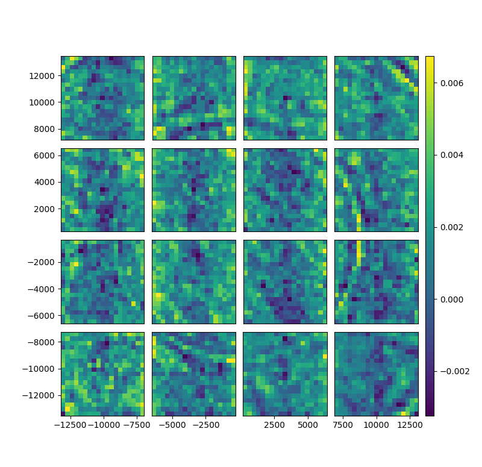

# Ziff


** Ziff is a wrapper to use Piff on ZTF images **

## Credit

R. Graziani (r.graziani@clermont.in2p3.fr, CNRS/IN2P3), M. Rigault (m.rigault@ipnl.in2p3.fr, CNRS/IN2P3)


# Installation

You first need Piff compatible with ZTF:
```bash
git clone https://github.com/rgraz/PIFFZTF.git
cd PIFFZTF
python setup.py install
```

(Requirements galsim, treecorr, available @ https://github.com/rmjarvis, together with latest version of Piff)

And ztfquery, ztfimg  (available @ https://github.com/MickaelRigault)

Then,
```bash
git clone https://github.com/rgraz/ziff.git
cd ziff
python setup.py install
```

# Fitting PSF on ZTF.

## One image ( = 1 quadrant)

Choose an image, for example `ztf_20190917468333_000698_zi_c03_o_q2_sciimg.fits`. And instanciate Ziff.

```python
from ziff.ziff import Ziff
z = Ziff( `ztf_20190917468333_000698_zi_c03_o_q2_sciimg.fits`, mskimg = None )

z.get_ztfimg()[0].show()
```


If no mskimg is given, ziff will look for one using the sciimg prefix. It also builds on the fly standard catalogs to calibrate PSF from  gaia online catalogs. These are accessible through the attribute `z.catalog`.

Default PSF configuration input to piff is given in `ziff/data/default_config.json` file and is accessible through attribute `z.config`.
It can be changed the following way:
```python
z.set_config_value('i/o,nstars',2000) # In general we only have ~200 calibrators / quadrant
z.set_config_value('psf,interp,order',4)
z.set_config_value('psf,outliers,max_remove',20)
```

The PSF fit itself is done by using `run_piff` method to a catalog or catalog name.
```python
z.run_piff('gaia_calibration',overwrite_cat=True)
```

The Piff psf is stored in `z.psf`. Note that if you don't run piff but try to call `z.psf`, then it will look in the sciimg's path to check if piff already ran and load the psf if possible.

To then check the results, you can compute residuals to a given star catalog, here the default one named `gaia_full` which was automatically created.

```python
z.set_config_value('i/o,nstars', 10000)

# Loading the catalog as Piff Stars object
stars = z.make_stars('gaia_full', overwrite_cat=True)

# Measuring flux and centroid of stars. Right now, you should put use_minuit = True if fit_center=True
new_stars = z.reflux_stars(stars,fit_center=False, use_minuit=False)

# Computing the residuals 
residuals = z.compute_residuals(new_stars,normed=True,sky=200)

# Computing shape properties of stars : Size, T, g1, g2 and of the modeled stars
shapes = z.compute_shapes(new_stars)

```

Example of plots:

+ Ploting residuals

```python
import numpy as np
import matplotlib.pyplot as plt

fig, axes = plt.subplots(1,3,figsize=(13,3))
im_kwargs  = {'origin':'lower', 'vmin' : -0.1, 'vmax': 0.1}
i = axes[0].imshow(residuals[0].T, **im_kwargs)
axes[0].set_title('Flux residualsiduals to one star')
fig.colorbar(i,ax=axes[0])

im_kwargs  = {'origin':'lower', 'vmin' : -0.05, 'vmax': 0.05}
axes[1].set_title('Mean flux residualsiduals')
i = axes[1].imshow(np.mean(residuals,axis=0).T, **im_kwargs)
fig.colorbar(i,ax=axes[1])

axes[2].set_title('Median flux residualsiduals')
i = axes[2].imshow(np.median(residuals,axis=0).T, **im_kwargs)
fig.colorbar(i,ax=axes[2])
```


Ploting shapes

```python
fig, axes = plt.subplots(1,3,figsize=(12,3))
scat_kwargs = {'cmap':'RdBu_r', 's':50}

s = axes[0].scatter(shapes['u'],shapes['v'],c=np.asarray(shapes['T_data_normalized']),vmin=0.9,vmax=1.1,**scat_kwargs)
axes[0].set_title('T (data) (normalized)')
fig.colorbar(s,ax=axes[0])

s = axes[1].scatter(shapes['u'],shapes['v'],c=np.asarray(shapes['T_model_normalized']),vmin=0.9,vmax=1.1,**scat_kwargs)
fig.colorbar(s,ax=axes[1])
axes[0].set_title('T (model) (normalized)')

s = axes[2].scatter(shapes['u'],shapes['v'],c=np.asarray(shapes['T_data'])-np.asarray(shapes['T_model']),vmin=-0.05,vmax=0.05,**scat_kwargs)
fig.colorbar(s,ax=axes[2])
axes[0].set_title('T residuals (arcsec)')
```



## One CCD ( = 4 images)

Piff is able to handle multiple images to fit a PSF model over an entire ccd or event the entire focal plane. This is managed by ziff as you can input a set of images.
Let's assume we want to fit over a CCD, the commands stay the same.

```python
imgs = ['ztf_20190301483877_000579_zg_c07_o_q{}_sciimg.fits'.format(i+1) for i in range(4)]
z = ziff.ziff.Ziff(imgs,logger=logger,load_default_cat= True, build_default_cat = True)
z.set_config_value('i/o,nstars',1000)
z.set_config_value('psf,interp,order',4)
z.set_config_value('psf,outliers,max_remove',20)
z.run_piff('gaia_calibration',overwrite_cat=True)
```

This fit the psf.
Then to check the results, again:

```python
z.set_config_value('i/o,nstars',10000)
stars = z.make_stars('gaia_full',overwrite_cat=True)
new_stars = z.reflux_stars(stars,fit_center=True, use_minuit=True)
res = z.compute_residuals(new_stars,normed=True,sky=200)
shapes = z.compute_shapes(new_stars)
```


# Ziff collection

`ZiffCollection` is a class that handles multiple ziffs objects, in order to fit a bunch of images.

A useful way to use `ZiffCollection` is to load it from a ztfquery object and group the images by any key you want. In the following examples, `ZiffCollection` will load a list of `Ziff` objects grouped by `filefracday` and `ccdid`:

```python
from ztfquery import query
from ziff.ziff import ZiffCollection

zquery = query.ZTFQuery()
z = ziff.ziff.ZiffCollection.from_zquery(zquery,groupby=['filefracday','ccdid'])
```
All `Ziff` object are  stored in `z.ziffs`.
To eval a function over all ziffs object, you can use  `eval_func` or `eval_func_stars` :

```python
#FIT
z.eval_func('set_config_value',key_path = 'i/o,nstars',value=2000)
z.eval_func('set_config_value',key_path = 'psf,interp,order',value=4)
z.eval_func('set_config_value',key_path = 'psf,outliers,max_remove',value=20)
z.eval_func('run_piff',catalog='gaia_calibration',overwrite_cat = True)

#RESULTS
z.eval_func('set_config_value',key_path = 'i/o,nstars',value=2000)
stars = z.eval_func('make_stars',catalog='gaia_full')
new_stars = z.eval_func_stars('reflux_stars',stars_list = stars, fit_center=False, use_minuit=False)
res = z.eval_func_stars('compute_residuals',stars_list = new_stars)
shapes = z.eval_func_stars('compute_shapes',stars)

```

# Binned statistics

`BinnedStatistic` is a class to handle shapes measurements of a psf model on several exposures and CCDs.
Let's suppose you have computed the shapes of many stars using a `ZiffCollection` object:

```python
from ztfquery import query
zquery = query.ZTFQuery()
zquery.load_metadata(sql_query = "fid=1 and (obsjd BETWEEN 2458743.9 AND 2458744)" )

from ziff.ziff import ZiffCollection
z = ziff.ziff.ZiffCollection.from_zquery(zquery, groupby=['ccdid','filefracday'], build_default_cat = False, load_default_cat = False, save_cat  = False)

# You need to have run all psf and shapes of all ziffs in z.ziffs
shapes =  z.read_shapes() #Read all computed shapes
#Needs to compute the residuals firs
shapes['resT'] = shapes['T_model'] - shapes['T_data']
```

Then you can analyze the results with `BinnedStatistic`

```python

from ziff.stats import BinnedStatistic
bs = BinnedStatistic(shapes,groupby=['ccd'])

# Some filters of the data
bs.add_filter('RPmag',[12,18])
bs.add_filter('colormag',[-5,5])

fig, gs = bs.show_focal_plane('T_data', norm_key = 'T_data',norm_stat='median', norm_groupby=['ccd','fracday'])
fig, gs = bs.show_focal_plane('T_model', norm_key = 'T_data')
fig, gs = bs.show_focal_plane('resT')


```



